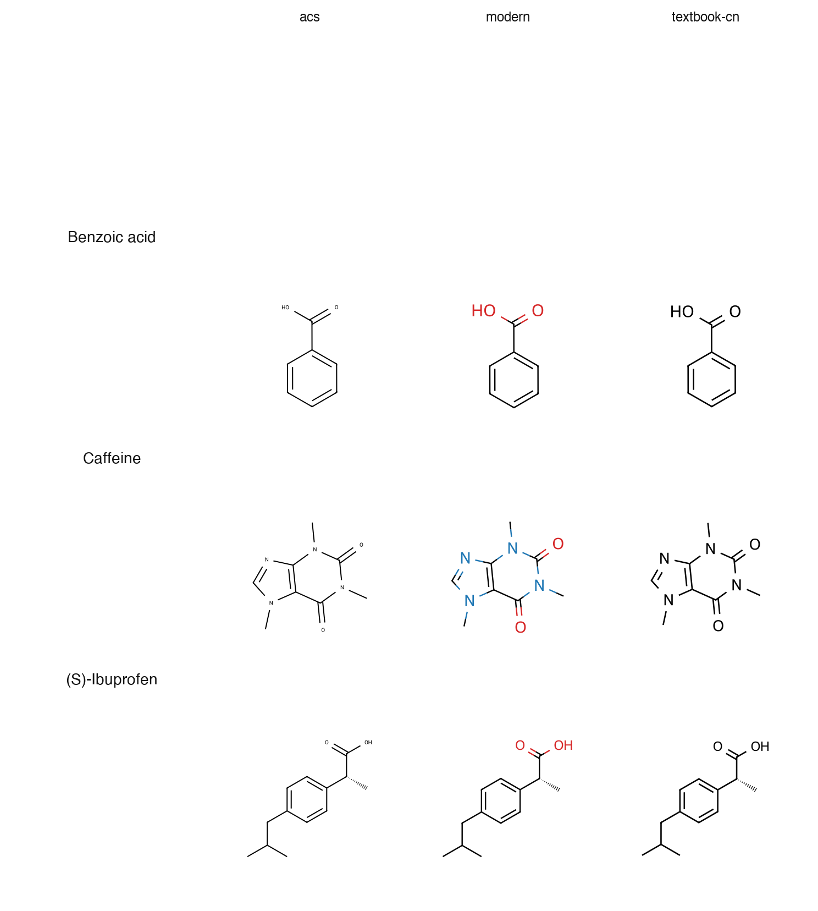
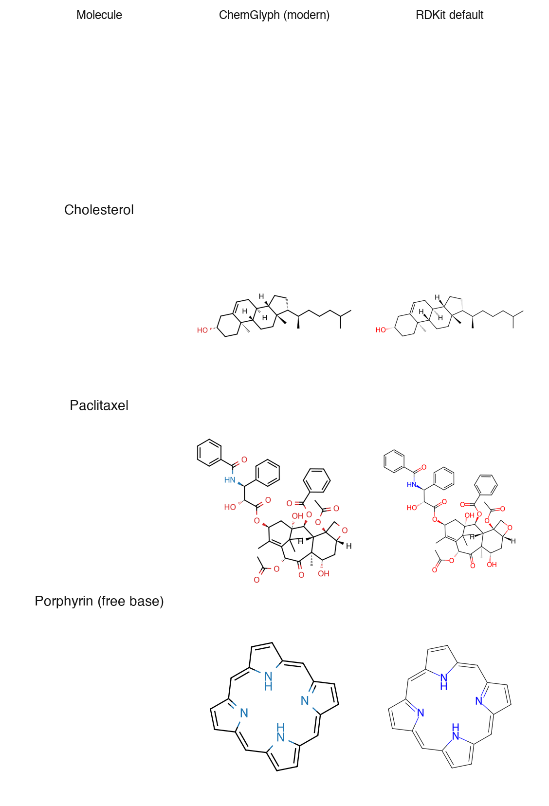

# ChemGlyph

**Publication-quality chemical structure & reaction rendering for AI agents.**

ChemGlyph is the KaTeX of chemistry: a rendering layer, a validation layer,
and an MCP interface on top of [RDKit](https://www.rdkit.org). It exists for
one job — turning structures and reaction schemes into figures you would
actually put in a paper, in an LLM-friendly way.

## 30-second example

```bash
pip install chemglyph
```

```python
import chemglyph

result = chemglyph.render_molecule("c1ccccc1")        # benzene
open("benzene.svg", "w").write(result.data)
```

That's it: one parse, one render, one SVG. `result.canonical_smiles`,
`result.mol_formula`, `result.mol_weight`, and `result.warnings` come along
for free.

## Why ChemGlyph

- **For AI agents**: four MCP tools with "use this when" docstrings, input
  examples, and structured outputs (SVG/PNG images plus metadata). No GUI, no
  browser, no editor session required.
- **Publication-quality defaults**: RDKit's CoordGen layout with three tuned
  styles — ACS-journal monochrome, screen-friendly `modern`, and a
  `textbook-cn` style for textbook aesthetics.
- **Reactions that don't look like RDKit's grid**: a purpose-built layout
  engine handles plus signs, arrow length from condition text, above/below
  labels, yields, equilibrium/retro arrows, and line wrapping.
- **Strict boundaries**: ChemGlyph validates what it can and refuses to guess
  about the rest. See [Non-goals](#non-goals).
- **Offline and dependency-light**: SVG assembly uses only the standard
  library; nothing is rendered through a network service.

## Style gallery

Three styles x three molecules (benzoic acid, caffeine, (S)-ibuprofen):



```python
chemglyph.render_molecule(smiles, style="acs")          # black/white, ACS journal
chemglyph.render_molecule(smiles, style="modern")       # colored heteroatoms, screens
chemglyph.render_molecule(smiles, style="textbook-cn")  # bold monochrome, textbook
```

All styles accept `transparent=True` (default) for transparent backgrounds,
and `fmt="png"` for bitmap output.

## Reactions

```python
spec = {
    "steps": [{
        "reactants": ["OC(=O)c1ccccc1O", "CC(=O)OC(C)=O"],
        "products": ["CC(=O)Oc1ccccc1C(=O)O", "CC(=O)O"],
        "conditions": {"above": "H₂SO₄ (cat.)", "below": "rt, 15 min"},
        "yield": "89%",
        "arrow": "forward",
    }],
    "style": "modern",
}
svg = chemglyph.render_reaction(spec)
```

Conditions are **pre-formatted Unicode text** — pass `H₂SO₄`, not `H2SO4`;
ChemGlyph deliberately does not parse formulas out of text. See
[docs/reaction_schema.md](docs/reaction_schema.md) for the full JSON schema
(multi-step chains, equilibrium ⇌, retro arrows, line wrapping).

Run the aspirin synthesis demo:

```bash
python examples/aspirin_synthesis.py   # -> examples/aspirin_synthesis.svg
```

## Validation

`chemglyph.validate_structure` reports parse errors and applies exactly four
quick fixes — unmatched brackets/ring closures (reported, never guessed),
kekulization failures of lowercase aromatic atoms, and nitrogen valence
errors via a formal `[N+]`. Everything else is RDKit's message, passed
through untouched.

```python
report = chemglyph.validate_structure("c1cccc1")
report.fixes[0].description    # 'lowercase aromatic atoms could not be kekulized...'
report.fixes[0].fixed_smiles   # 'C1CCCC1'
```

## Naming (v0.1: English only)

```python
chemglyph.parse_name("aspirin")   # 'CC(=O)Oc1ccccc1C(=O)O'
```

English IUPAC/common names resolve offline via OPSIN through the optional
extra (`pip install 'chemglyph[opsin]'`, plus a Java runtime). Chinese names
are reserved for v0.2 and raise a clear `NotImplementedError`.

## MCP: Claude Desktop and friends

Start the server (stdio transport) with the bundled console script:

```bash
chemglyph-mcp
```

Register it in Claude Desktop (macOS:
`~/Library/Application Support/Claude/claude_desktop_config.json`):

```json
{
  "mcpServers": {
    "chemglyph": {
      "command": "chemglyph-mcp"
    }
  }
}
```

Then ask *"画出阿司匹林的合成路线"*. The four tools:

| Tool | Use it when | Returns |
|---|---|---|
| `render_molecule` | the user asks to draw one structure from SMILES/InChI/molblock | SVG or PNG image + formula, MW, warnings |
| `render_reaction` | the user asks for a reaction or synthesis route | reaction SVG image |
| `validate_structure` | a SMILES may be malformed and you need a repair | validation report JSON |
| `parse_name` | the user gives a name like "aspirin" instead of SMILES | canonical SMILES or a clear error |

## Benchmarks & methodology

`benchmarks/` contains the fixed 20-molecule blind test from the project
specification, plus a generator that emits shuffled, numbered PNG/SVG figures
and `answer_key.json`:

```bash
python benchmarks/generate_blind_test.py --seed 1234
```

Pass criteria: 2–3 chemical practitioners blind-pick figures they would
publish; a ChemGlyph selection rate of ≥ 40% passes. The metal complex
(ferrocene) and the free-base porphyrin are excluded from the denominator and
recorded separately as known limitations.



The comparison above shows ChemGlyph `modern` against RDKit's stock output on
three §11 blind-test molecules (ChemDraw panels are added manually during the
blind review).

## Roadmap

- **v0.2**: Chinese IUPAC naming; mechanism/electron-pushing arrow research
  (deliberately out of v0.1).
- **Later**: multi-column reaction layout, tighter viewBox cropping, and
  style-level font metrics.

## Non-goals

ChemGlyph will not grow into: a structure editor GUI (Ketcher/ChemDraw
competition), 3D visualization, mechanism electron-pushing arrows (v0.1),
retrosynthesis prediction, property prediction, online database queries, or
Chinese naming in the v0.1 line. See the project specification for the
complete list.

## Development

```bash
python -m venv .venv
.venv/bin/pip install -e ".[dev]"
.venv/bin/ruff check . && .venv/bin/ruff format . && .venv/bin/pytest
```

Python ≥ 3.11, RDKit ≥ 2024.9, MIT licensed. Public API is typed and
documented; all errors derive from `chemglyph.errors.ChemGlyphError`.
